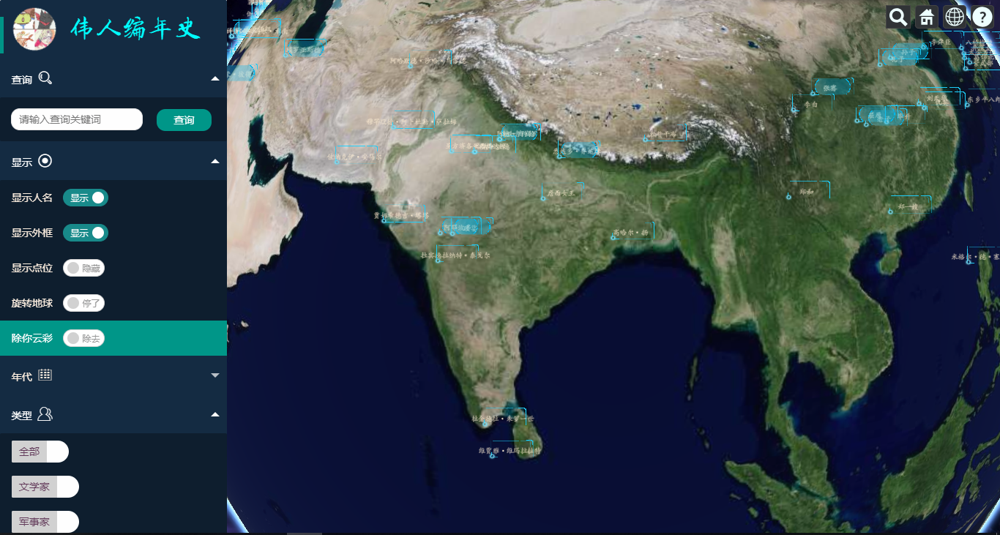
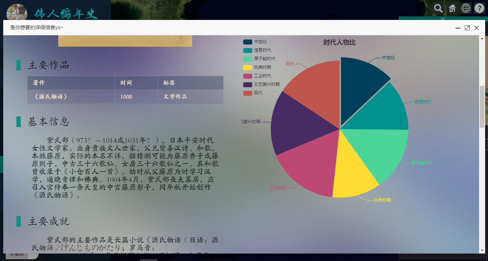
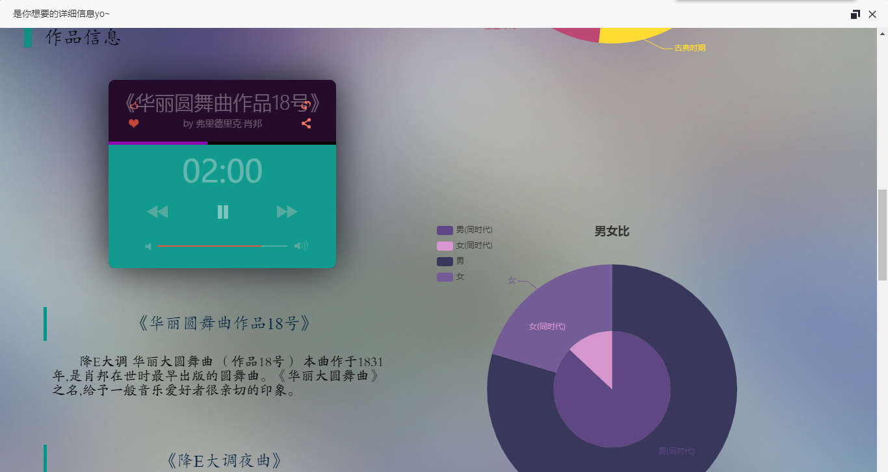
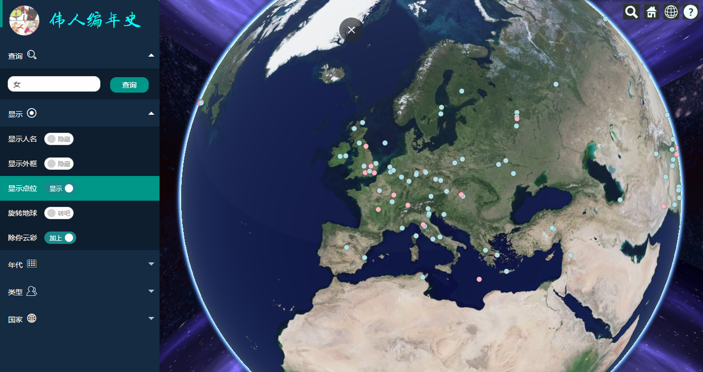
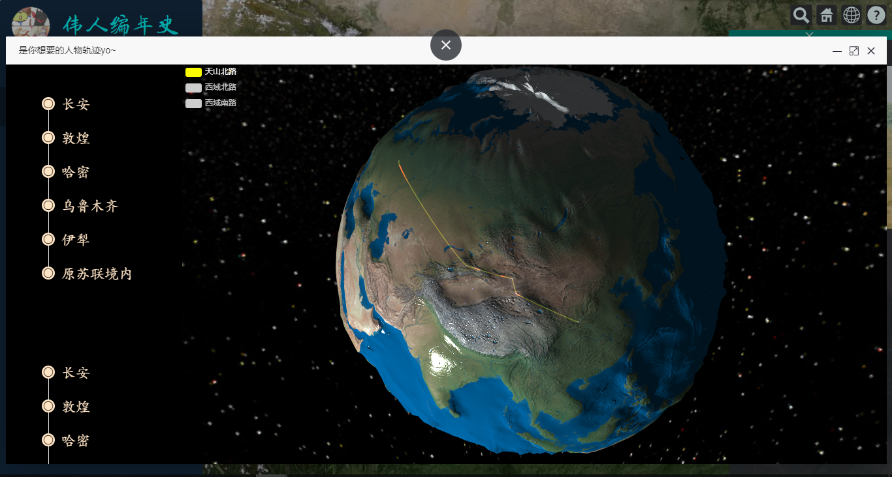
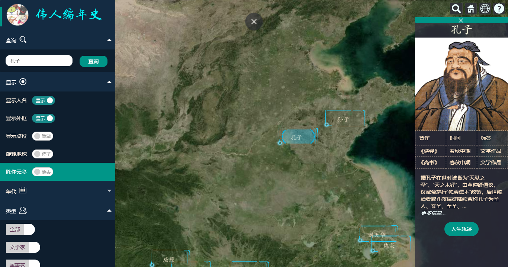

# 伟人编年史
 &emsp;&emsp;以可视化展示历史伟人时空信息分布为目标，利用 **Cesium** 组件搭建 **webGIS** 平台，后端使用 PHP 及 MySQL，并结合 Echarts 展示历史伟人的三维空间分布及行踪与数据分析。 

# 展示方式
+ 人物显示方式默认按照框图标识和人名显示，也可以通过左侧开关将显示方式变为以点位的方式显示。
    + 搜索框支持对一切信息模糊搜索。
    + 左侧下方的三个二级菜单均为用来筛选伟人，三个筛选条件分别为：人物所处时代（'古典时期', '中世纪', '文艺复兴时期', ' 工业时代', '现代', '原子能时代', '信息时代'）、人物类型（'文学家', '军事家', '工程 师', '商业家', '科学家', '宗教学', '艺术家', '音乐家'）以及人物所在国家（'中国','美 国','英国','日本','德国','前苏联'等。
+ 人物图标均可点击，点击之后会在右侧浮现出该伟人的信息， 包括：姓名、肖像、主要作品、及简介，若想进一步了解可以点击“更多信息”。
+ 对于部分人物（一生跨域较大）为其制作了人生轨迹地图，可以通过点击“人生轨迹”来查看。

# 后续
+ 增加时间轴功能
+ 优化筛选条件，使之可以交叉进行交集查询
+ 可视化录入伟人信息界面使加入数据更简便，而非使用原生SQL
----

*\*本项目的产品设计及开发工作由方竞宇，杨润奇，王凯杰，侯博文共同完成*